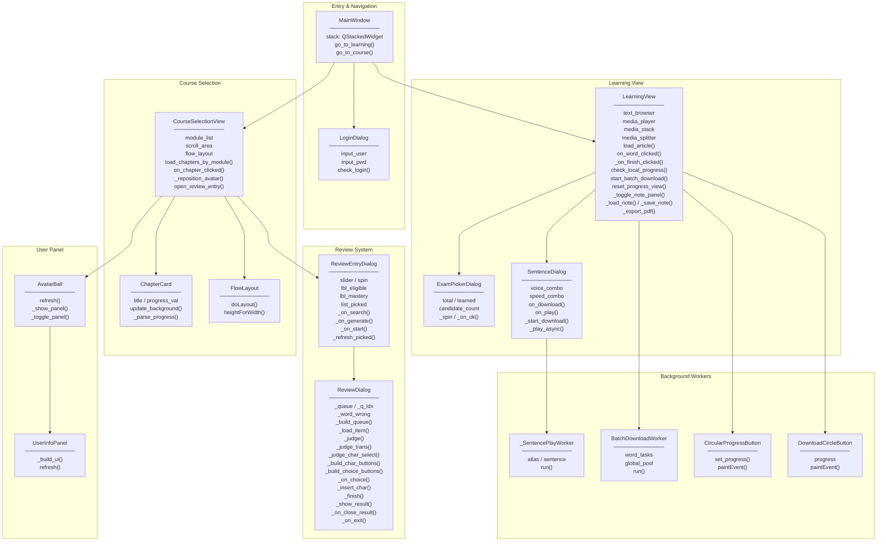
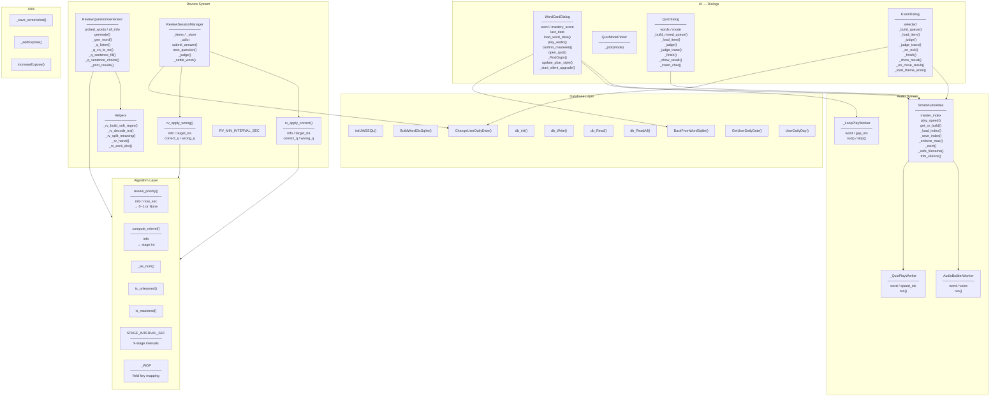
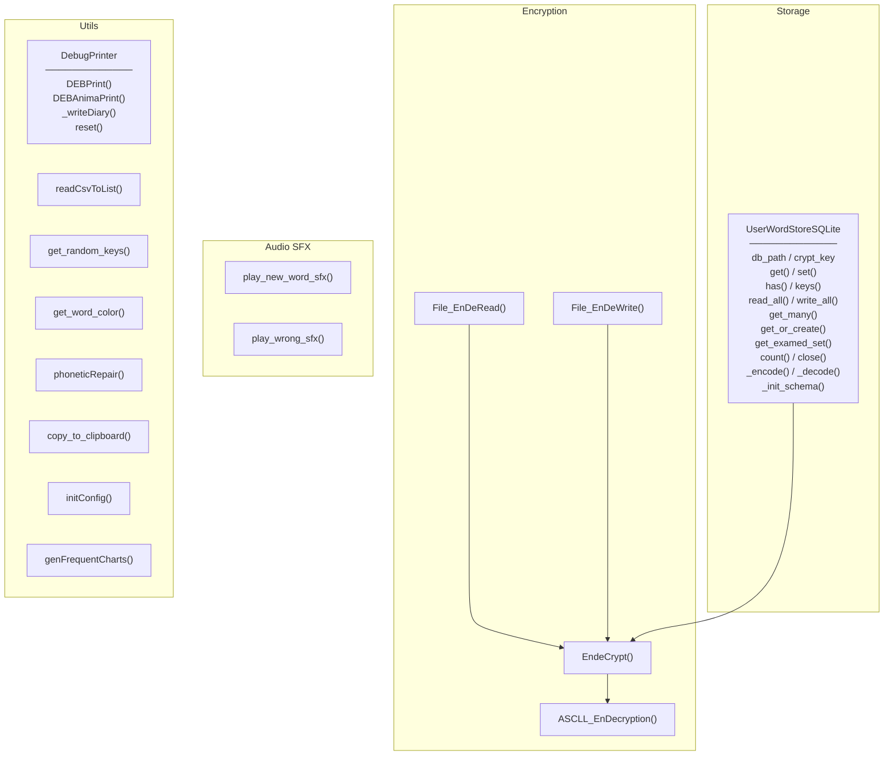
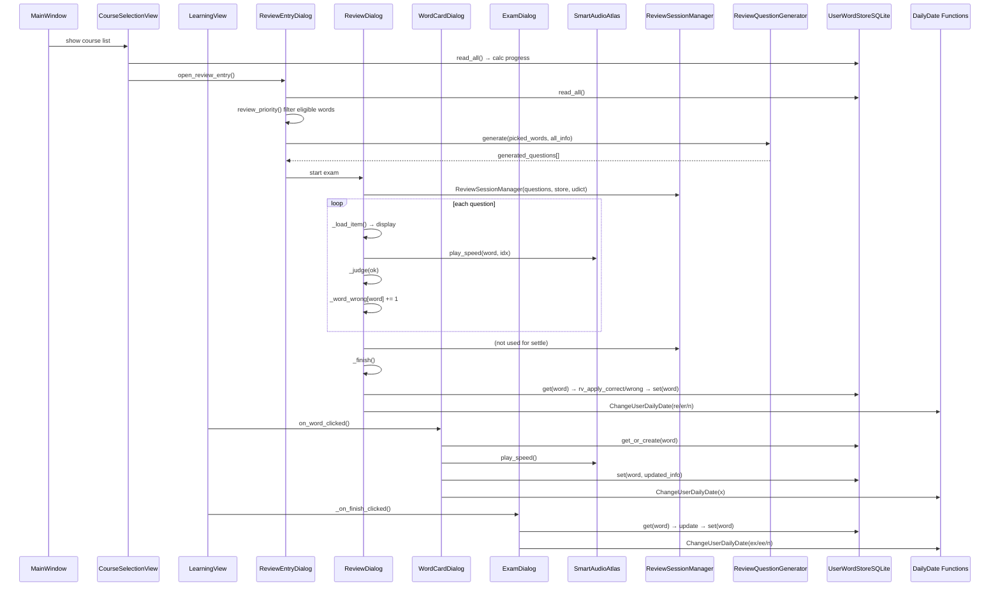
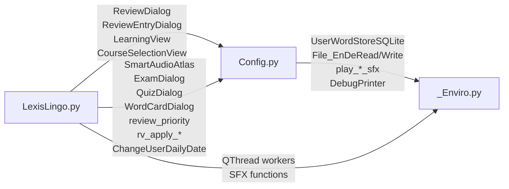

# LexisLingo-1.0.0

# 創発システム知能専攻-Research 01: Contextual Lexicon Project

## LexisLingo.py

---

## Config.py

---

## _Enviro.py

---

## LexisLingo ↔ Config Interaction

---

## Module Dependencies

本报告旨在展示初步量化分析结果，重点聚焦于词汇原型（Lemmas）的提取与形态学基础特征分布。
This report presents the preliminary quantitative analysis, focusing on the extraction of word lemmas and the distribution of fundamental morphological characteristics.

---

### 1. 高频核心词汇原型提取 (Top 30 Most Frequent Lemmas)

以下图表直观呈现了语料库中经过形态学回溯后，出现频次最高的前 30 个单词原型。作为动态语境生成的基础，这些核心词汇构成了初始语义网络的锚点。

The following chart illustrates the top 30 most frequently occurring word lemmas in the corpus after morphological tracing. Serving as the foundation for dynamic context generation, these core vocabulary items act as the anchor points of the initial semantic network.

  
   
  <em>Fig 1: 频次最高的前30个单词原型分布 / Top 30 Word Lemmas Distribution</em>

---

### 2. 词汇复杂度与长度分布 (Word Length Frequency Distribution)

本节展示了不同长度单词的频次分布模型。该分布特征客观反映了语料库的词汇复杂度。

This section displays the frequency distribution across different word lengths. This characteristic objectively reflects the lexical complexity of the corpus.

  
   
  <em>Fig 2: 单词长度与出现频率的映射关系 / Mapping of Word Length to Frequency</em>

---
> **Note:** 演示数据集基于闭环语境过滤生成，完整链式释义网络记录详见后续更新。 
> The demo dataset is generated based on closed-loop context filtering. The complete chained semantic network records will be detailed in subsequent updates.
